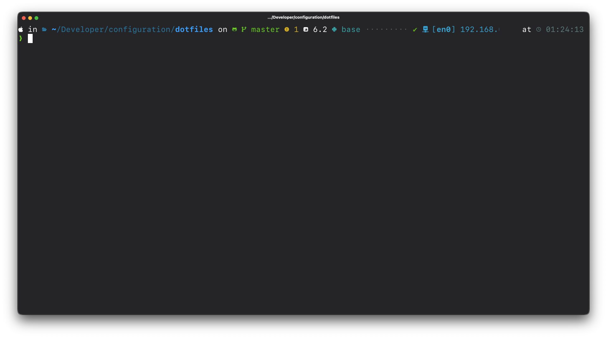

# dotfiles

This repository contains some configuration files I normally use for daily work.

## Folder contents

### Terminal

* **zsh**: oh-my-zsh configuration files for GNU/Linux distros and macOS.
* **kitty**: Kitty terminal configuration file.
* **ghostty**: Ghostty terminal configuration file.

### Editors

* **vscode**: Visual Studio Code JSON settings.
* **fleet**: JetBrains Fleet JSON settings.

## Xcode theme

This repository used to host my personal Xcode color theme. It now has its own dedicated repository and it finally has a name of its own: [**Neon Glow**](https://github.com/Angel5215/NeonGlow).