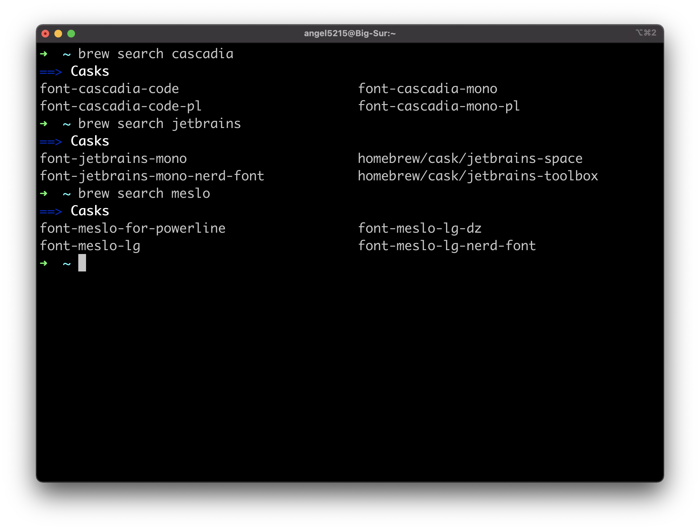
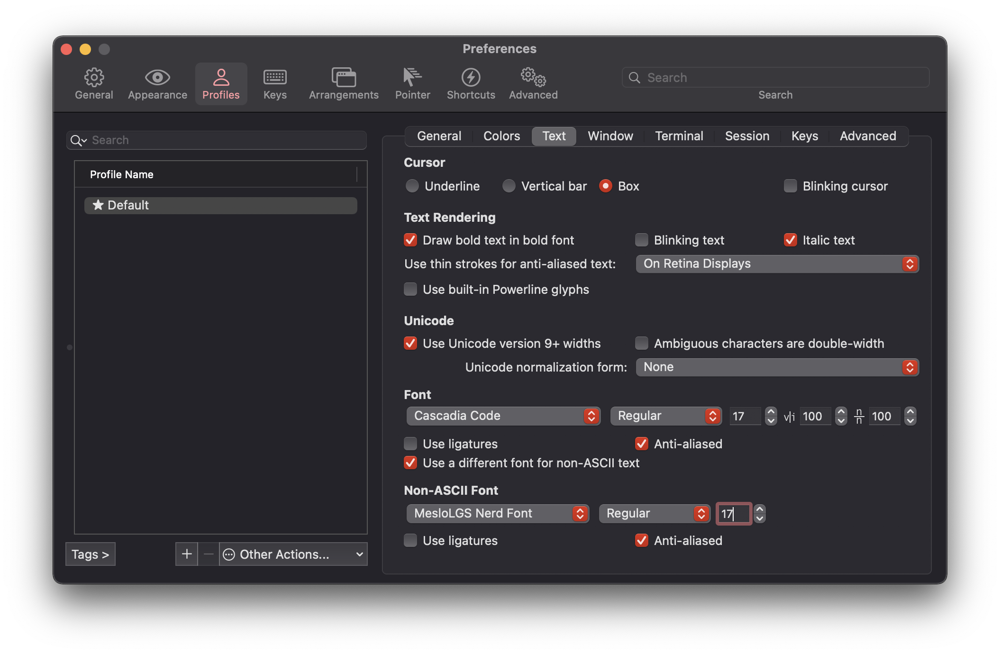
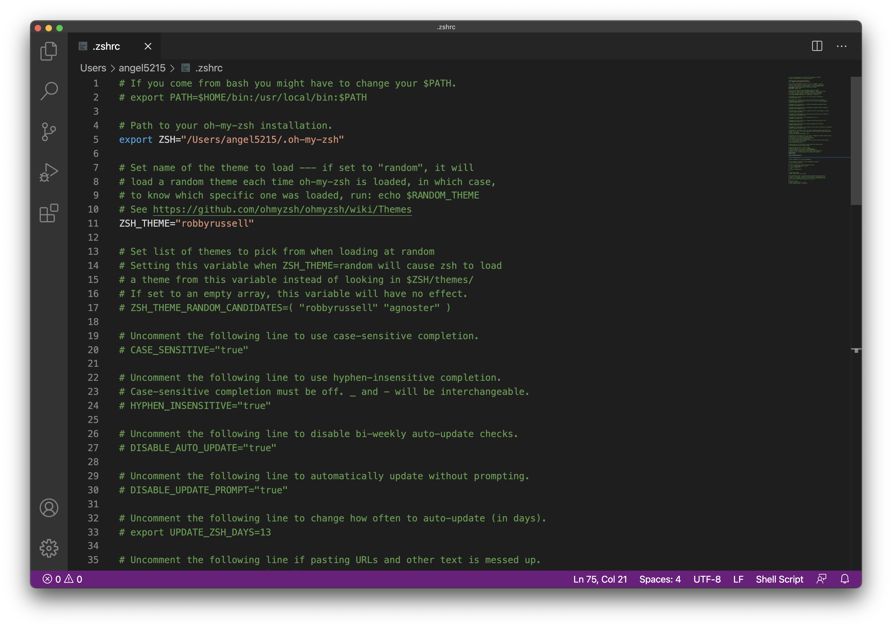
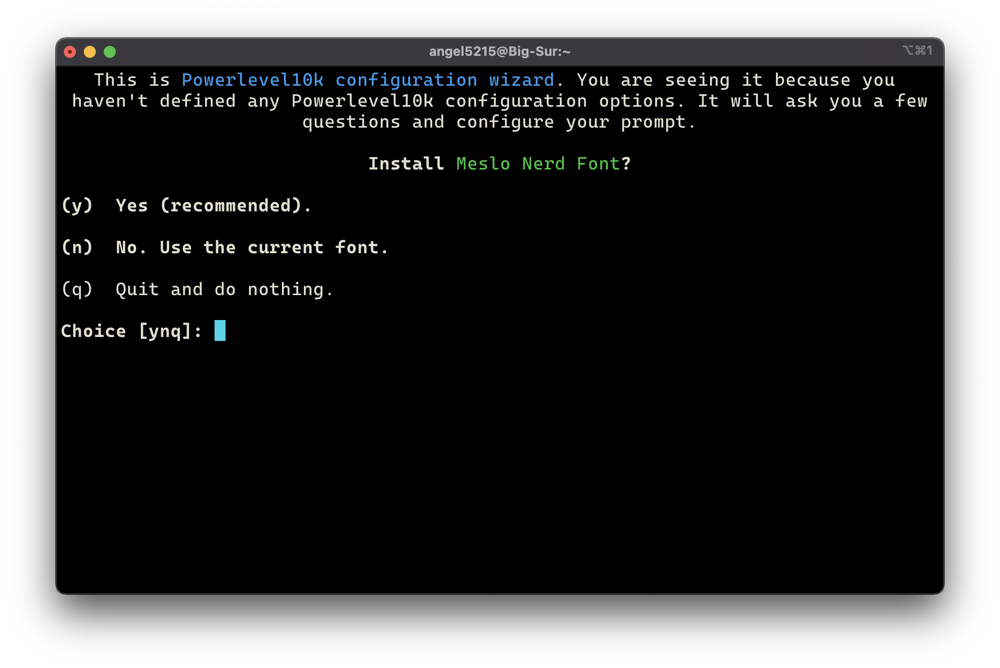
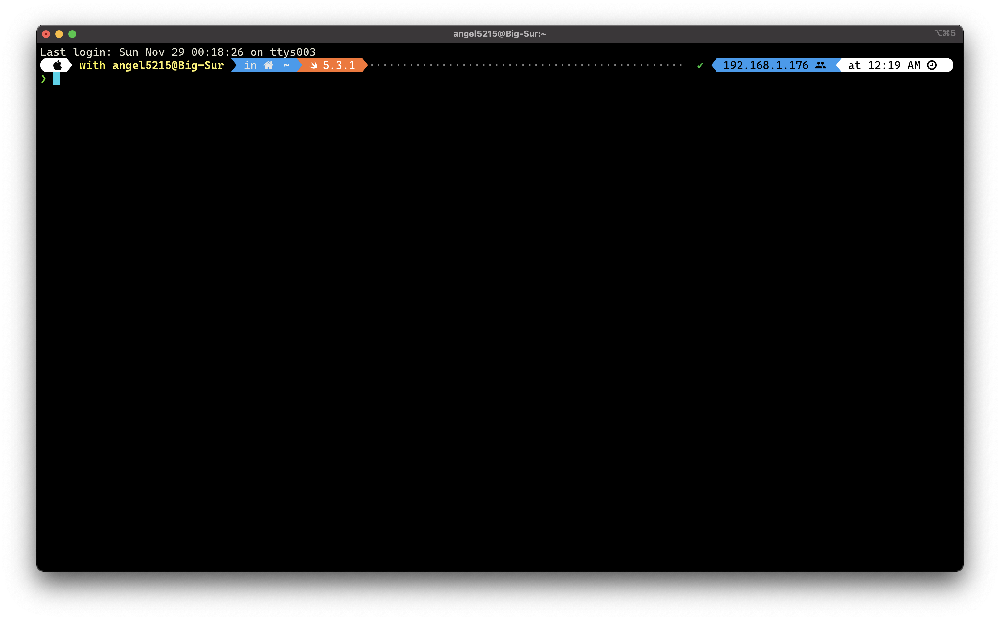
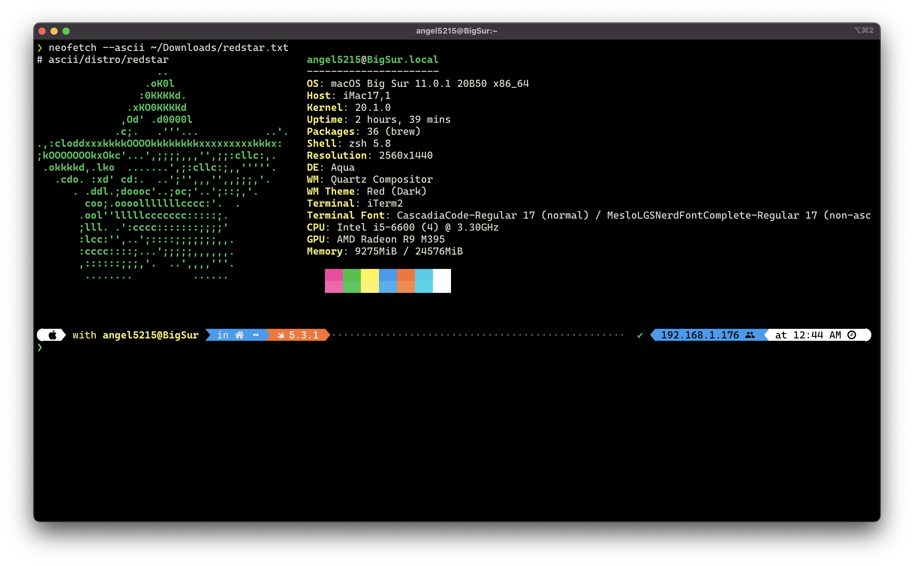
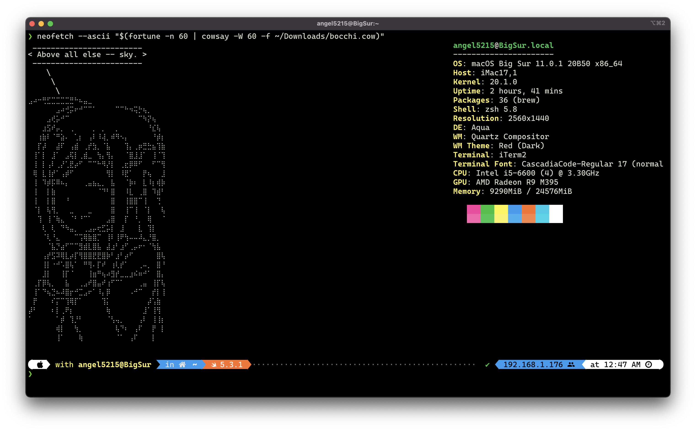

# Terminal setup with images

Many people have asked me how to customize your terminal to achieve something like this:

<p align="center">
  
</p>

This is a step-by-step tutorial on how to customize your terminal to have a colorful prompt, images and icons on your git repository info.

**Note**: This tutorial was written for macOS 11 (Big Sur). These commands should run fine on previous versions like Catalina and Mojave. Nevertheless, you should check that all packages, fonts and settings modified here are available for your system before following this tutorial. 

**Note 2**: You are responsible for all changes made to your computer. At the very least you should have basic knowledge on how to use the terminal and be cautious for all commands you run on your computer. All commands left here were copied from its official repositories, you should verify they are still valid before running them. All links to official repositories will be provided at each step.  

## Install iTerm2

> iTerm2 is a replacement for Terminal and the successor to iTerm. It works on Macs with macOS 10.14 or newer. iTerm2 brings the terminal into the modern age with features you never knew you always wanted.

To be able to show images in your terminal, you should install [**iTerm2**](https://iterm2.com/) which is a replacement for the Terminal.app found on all macOS systems. 

1. Download iTerm2 from its [official source](https://iterm2.com/).

2. Unzip the downloaded file.

3. Drag **iTerm2** to your Applications folder in the Finder. 

<p align="center">
  
</p>

## Install Xcode and the Command Line Tools

1. Open the App Store and search "Xcode". You should see a small button to install it. 

<p align="center">
  
</p>

2. Open Xcode after installing to agree to its license agreement.

**This step requires you to type your password**

<p align="center">
  
</p>

3. Install the Xcode Command Line Tools.

> The `xcode-select` command manages the active developer directory for Xcode and BSD tools. The `--install` option opens a user interface dialog to request automatic installation of the command line developer tools.—[`xcode-select` man page](https://developer.apple.com/documentation/os/reading_unix_manual_pages).

Open iTerm2 and run the following [command](https://developer.apple.com/library/archive/technotes/tn2339/_index.html):

```zsh
xcode-select --install
```

<table>
  <tr>
    <th>Command Line Tools installation UI</th>
    <th>Command Line Tools installation completed</th>
  </tr>
  <tr>
    <td>
      <p align="center">
        
      </p>
    </td>
      <td>
      <p align="center">
        
      </p>
    </td>
  </tr>
</table>

## Install Homebrew

> The Missing Package Manager for macOS (or Linux)

Homebrew is a package manager built for macOS. It allows us to install software not included in macOS using a command line interface. We will use it to install commands like `neofetch`, `fortune`, `cowsay` and some fonts to display icons.

4. Install [Homebrew](https://brew.sh/) by running the following command on iTerm2.

**This step will ask you to type your password inside the terminal**

```zsh
/bin/bash -c "$(curl -fsSL https://raw.githubusercontent.com/Homebrew/install/HEAD/install.sh)"
```

Homebrew will show you a screen like this after typing your password.

<p align="center">
  
</p>

If everything installs correctly, you should see a success message like this:

<p align="center">
  
</p>

## Install Oh My Zsh

>A delightful community-driven (with 1700+ contributors) framework for managing your zsh configuration. Includes 200+ optional plugins (rails, git, OSX, hub, capistrano, brew, ant, php, python, etc), over 140 themes to spice up your morning, and an auto-update tool so that makes it easy to keep up with the latest updates from the community.

Oh My Zsh is a framework for managing your [ZSH](https://en.wikipedia.org/wiki/Z_shell) configuration. From macOS Catalina and later, the default shell for the terminal is ZSH. We use this framework to customize the terminal in a simple and easy way using a configuration file. 

5. Install [Oh My Zsh](https://github.com/ohmyzsh/ohmyzsh#basic-installation) by running the following command on iTerm2:

```zsh
sh -c "$(curl -fsSL https://raw.githubusercontent.com/ohmyzsh/ohmyzsh/master/tools/install.sh)"
```

After Oh My Zsh installs successfully, you should see the following in your terminal.

<p align="center">
  
</p>

## Install commands and fonts

> Neofetch is a command-line system information tool written in bash 3.2+. Neofetch displays information about your operating system, software and hardware in an aesthetic and visually pleasing way.–https://github.com/dylanaraps/neofetch

6. Install `neofetch` using [Homebrew](https://github.com/dylanaraps/neofetch/wiki/Installation#macos-homebrew)

```zsh
brew install neofetch
```

After installing, you can verify by running the `neofetch` command in your terminal. You should a screen similar to this:

<p align="center">
  
</p>

7. Install [Cascadia Code](https://github.com/microsoft/cascadia-code), [Meslo Nerd Fonts](https://github.com/ryanoasis/nerd-fonts) and [JetBrains Mono](https://github.com/JetBrains/JetBrainsMono) using [Homebrew](https://github.com/Homebrew/homebrew-cask-fonts).

- Cascadia Code and JetBrains Mono are monospaced fonts that look good for a terminal prompt. You can install either one of them but I like to install both. 

- Nerd Fonts are modified fonts that contain patches to be able to display icons that are not usually included with them. In this case we will install the Meslo nerd fonts which are the most compatible fonts with Powerlevel10K (a theme we will be using for Oh My Zsh).

```zsh
# You only need to do run this line once. If you install fonts later, you don't need to run it again.
brew tap homebrew/cask-fonts   

# These fonts can be searched from Homebrew by using `brew search` as shown in the image below.
brew install --cask font-cascadia-code font-jetbrains-mono font-meslo-lg-nerd-font
```

<p align="center">
  
</p>

After the fonts are installed, you should be able to use them in any application.

### Extras

**These commands are not necessary**, but they are included here because you might want to display a different ASCII art in your terminal instead of an image. 

- Fortune

> `fortune` is a program that displays a pseudorandom message from a database of quotations.—https://en.wikipedia.org/wiki/Fortune_(Unix)

- Cowsay

> `cowsay` is a program that generates ASCII pictures of a cow with a message. It can also generate pictures using pre-made images of other animals, such as Tux the Penguin, the Linux mascot.—https://en.wikipedia.org/wiki/Cowsay

8. Install `fortune` and `cowsay` using Homebrew.
```zsh
brew install fortune cowsay
```

## Enable fonts in iTerm2

9. In your Menu Bar go to **iTerm**->**Preferences** (shortcut `⌘,`)

10. Navigate to **Profiles** and select the **Text** tab.

11. Select "Cascadia Code" or "Jetbrains Mono" as your font.

12. Enable "Use a different font for non-ASCII text" and select "MesloLGS Nerd Font" (not the Mono version) as your font to display non-ASCII text (e.g. icons, symbols, etc.).

<p align="center">
  
</p>

## Install Powerlevel10K theme

> Powerlevel10k is a theme for Zsh. It emphasizes speed, flexibility and out-of-the-box experience.

Powerlevel10K is a ZSH theme compatible with Oh My Zsh. This theme allows us to customize our terminal with several colors, and sections by using a secondary configuration file `.p10k.zsh`. 

13. Install Powerlevel10K by running the [following command](https://github.com/romkatv/powerlevel10k#oh-my-zsh) in iTerm2:

```zsh
git clone --depth=1 https://github.com/romkatv/powerlevel10k.git ${ZSH_CUSTOM:-$HOME/.oh-my-zsh/custom}/themes/powerlevel10k
```

## ZSH configuration file

Oh My Zsh provides us with a default [configuration file](https://github.com/ohmyzsh/ohmyzsh/blob/master/templates/zshrc.zsh-template) that is copied to your home folder as a hidden file `~/.zshrc`. This configuration is loaded by your terminal when it starts and it is the place where we can configure themes, plugins, commands to run when the terminal starts, aliases and [many more settings](https://github.com/ohmyzsh/ohmyzsh#using-oh-my-zsh).

14. Open your `.zshrc` using your favorite text editor (e.g. `nano`, `vim`, Sublime Text, Visual Studio Code).

```zsh
# In this case, I want to edit it with Visual Studio Code.
code ~/.zshrc
```

When you open it, you should see this content:

<p align="center">
  
</p>

Change its content to this:

```zsh
# If you come from bash you might have to change your $PATH.
# export PATH=$HOME/bin:/usr/local/bin:$PATH

# Path to your oh-my-zsh installation.
export ZSH="$HOME/.oh-my-zsh"

# OH-MY-ZSH THEME
ZSH_THEME="powerlevel10k/powerlevel10k"

# PLUGINS
plugins=(git)

# SOURCE OH-MY-ZSH main configuration.
source $ZSH/oh-my-zsh.sh

# SOURCE POWERLEVEL10K THEME
[[ -f ~/.p10k.zsh ]] && source ~/.p10k.zsh
```

## Configure Powerlevel10K

This repository contains a customized version of the official Powerlevel10K configuration file (`.p10k.zsh`). You can either copy mine or allow Powerlevel10K to configure itself. 

### Copy my configuration

15a. Clone or download the `dotfiles` repository. 

```zsh
git clone https://github.com/Angel5215/dotfiles
```

15b. Copy my `.p10k.zsh` version to your home folder.

```zsh
# Navigate to your local copy of the `dotfiles` repository
cd ~/{PATH-TO-DOTFILES}
cp p10k.zsh ~/.p10k.zsh
```

15c. Close iTerm2 and reopen it. 

### Allow Powerlevel10K to configure itself

15. Close iTerm2 and reopen it. Powerlevel10K should prompt a command line interface to configure itself. Do not install Meslo Nerd Font as it is already installed.

<p align="center">
  
</p>

### After configuring Powerlevel10K

Regardless of how you configured Powerlevel10K, you should now see a prompt like this after restarting iTerm2.

<p align="center">
  
</p>

## Configure `neofetch`

16. Edit your `.zshrc` configuration file and append this to the end of the file. 
  - Neofetch will only run when opening iTerm2 (this is because rendering images only works in iTerm2 and it might generate random text in other terminals).
  - Change `{PATH-TO-SOME-IMAGE}` to the path of any image you want to display in your terminal including its extension. (e.g. `~/Downloads/my-awesome-image.png`)
  - Read `neofetch` documentation for more information on [**crop mode**](https://github.com/dylanaraps/neofetch/wiki/What-is-Waifu-Crop%3F).

```zsh
# RUN NEOFETCH ONLY FOR iTerm
if [ $TERM_PROGRAM = "iTerm.app" ]
then
    neofetch --iterm2 {PATH-TO-SOME-IMAGE} --crop_mode fill
fi
```
17. Restart iTerm 2

You should now see an image on your terminal every time you launch it!

<p align="center">
  
</p>

### Extra configurations for `neofetch`

#### Display a custom ASCII logo

ASCII can be rendered on any terminal, so you can delete the `if then fi` statement from the lines above and only leave the `neofetch` call.

You just need to substitute `{PATH-TO-SOME-ASCII-LOGO}` with path to some ASCII text file that contains the logo you want to display (e.g. `~/Downloads/my-logo.txt`)

```
neofetch --ascii {PATH-TO-SOME-ASCII-LOGO}
```

<p align="center">
  
</p>

#### Display a custom ASCII with some quote

You can combine the `fortune` and `cowsay` commands to display a custom ASCII with a quote. You may search in Google how to make a custom `.cow` file to use with cowsay or use some default *cows*. This is also available to use in other terminals beside iTerm2 as it just renders text.

Substitute `{PATH-TO-COW-FILE}` with a path to a valid `.cow` file (e.g. `~/Downloads/bocchi.cow`)

```zsh
neofetch --ascii "$(fortune -n 60 | cowsay -W 60 -f {PATH-TO-COW-FILE})"
```

<p align="center">
  
</p>