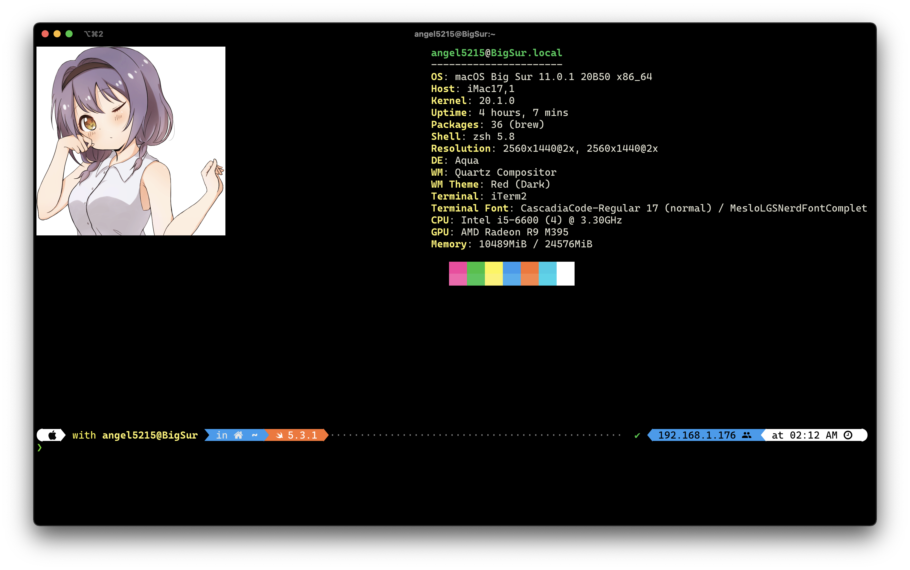
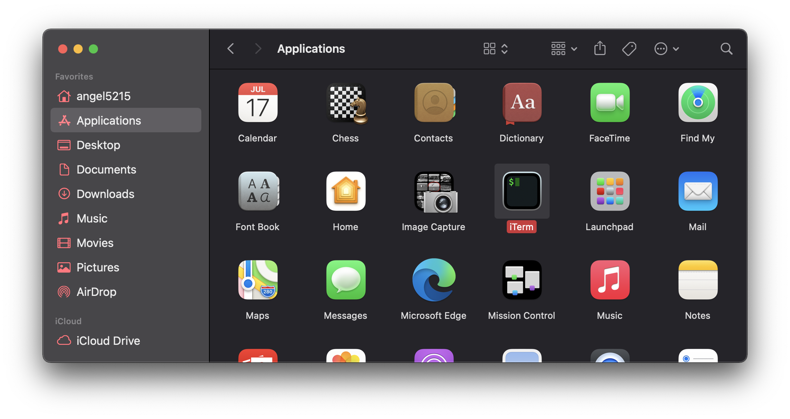
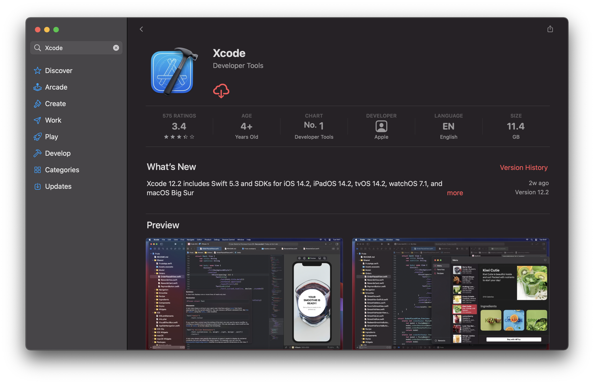
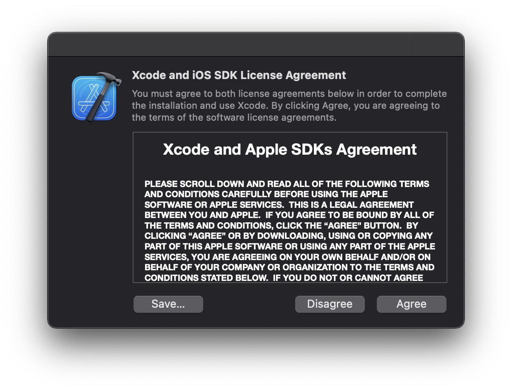
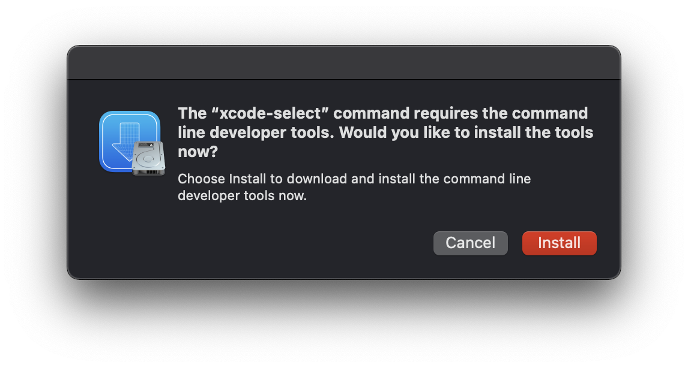
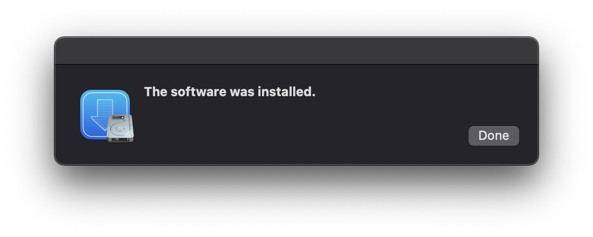
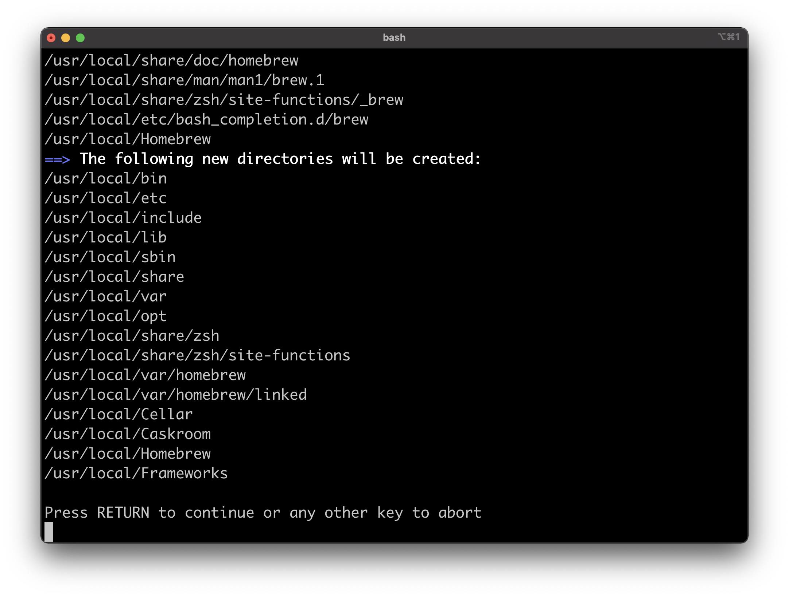
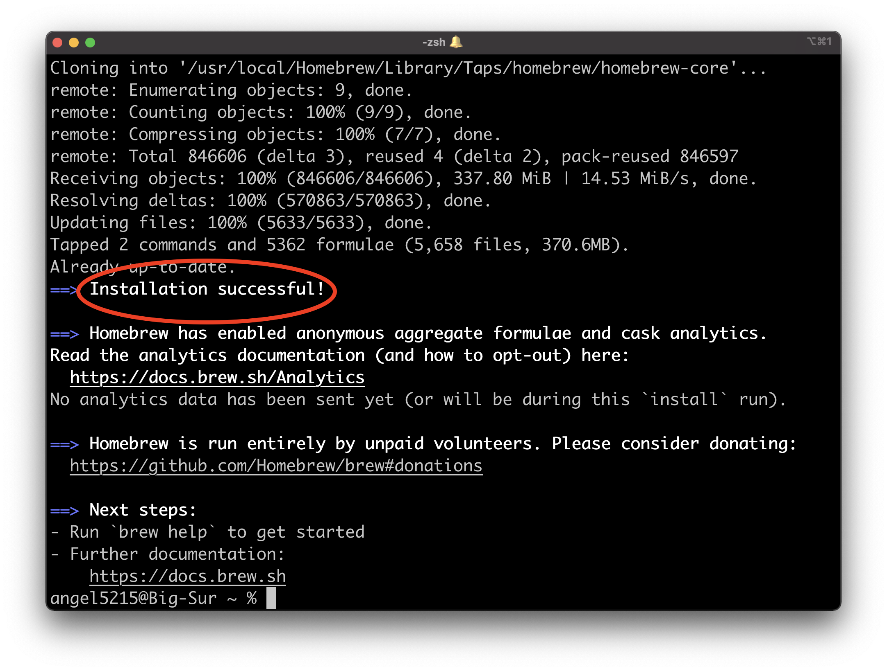
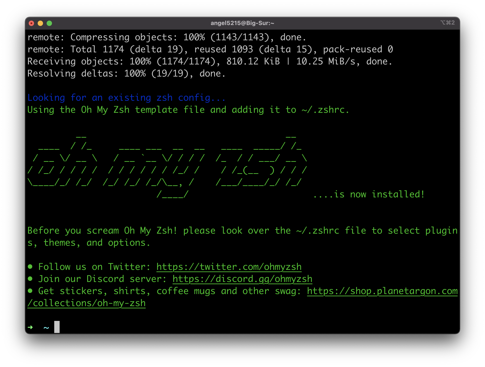
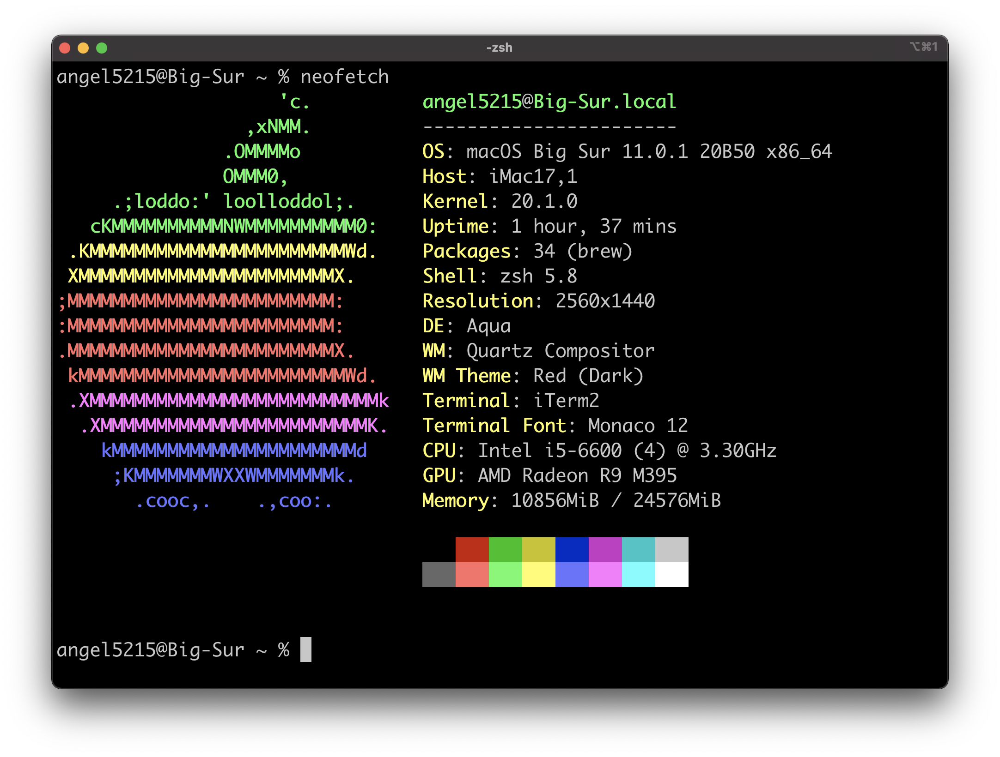

# Terminal setup with images

Many people have asked me how to customize your terminal to achieve something like this:

<p align="center">
  
</p>

This is a step-by-step tutorial on how to customize your terminal to have a colorful prompt, images and icons on your git repository info.

**Note**: This tutorial was written for macOS 11 (Big Sur). These commands should run fine on previous versions like Catalina and Mojave. Nevertheless, you should check that all packages, fonts and settings modified here are available for your system before following this tutorial. 

**Note 2**: You are responsible for all changes made to your computer. At the very least you should have basic knowledge on how to use the terminal and be cautious for all commands you run on your computer. All commands left here were copied from its official repositories, you should verify they are still valid before running them. All links to official repositories will be provided at each step.  

## Install iTerm2

> iTerm2 is a replacement for Terminal and the successor to iTerm. It works on Macs with macOS 10.14 or newer. iTerm2 brings the terminal into the modern age with features you never knew you always wanted.

To be able to show images in your terminal, you should install [**iTerm2**](https://iterm2.com/) which is a replacement for the Terminal.app found on all macOS systems. 

1. Download iTerm2 from its [official source](https://iterm2.com/).

2. Unzip the downloaded file.

3. Drag **iTerm2** to your Applications folder in the Finder. 

<p align="center">
  
</p>

## Install Xcode and the Command Line Tools

1. Open the App Store and search "Xcode". You should see a small button to install it. 

<p align="center">
  
</p>

2. Open Xcode after installing to agree to its license agreement.

**This step requires you to type your password**

<p align="center">
  
</p>

3. Install the Xcode Command Line Tools.

> The `xcode-select` command manages the active developer directory for Xcode and BSD tools. The `--install` option opens a user interface dialog to request automatic installation of the command line developer tools.—[`xcode-select` man page](https://developer.apple.com/documentation/os/reading_unix_manual_pages).

Open iTerm2 and run the following [command](https://developer.apple.com/library/archive/technotes/tn2339/_index.html):

```zsh
xcode-select --install
```

<table>
  <tr>
    <th>Command Line Tools installation UI</th>
    <th>Command Line Tools installation completed</th>
  </tr>
  <tr>
    <td>
      <p align="center">
        
      </p>
    </td>
      <td>
      <p align="center">
        
      </p>
    </td>
  </tr>
</table>

## Install Homebrew

> The Missing Package Manager for macOS (or Linux)

Homebrew is a package manager built for macOS. It allows us to install software not included in macOS using a command line interface. We will use it to install commands like `neofetch`, `fortune`, `cowsay` and some fonts to display icons.

4. Install [Homebrew](https://brew.sh/) by running the following command on iTerm2.

**This step will ask you to type your password inside the terminal**

```zsh
/bin/bash -c "$(curl -fsSL https://raw.githubusercontent.com/Homebrew/install/HEAD/install.sh)"
```

Homebrew will show you a screen like this after typing your password.

<p align="center">
  
</p>

If everything installs correctly, you should see a success message like this:

<p align="center">
  
</p>

## Install Oh My Zsh

>A delightful community-driven (with 1700+ contributors) framework for managing your zsh configuration. Includes 200+ optional plugins (rails, git, OSX, hub, capistrano, brew, ant, php, python, etc), over 140 themes to spice up your morning, and an auto-update tool so that makes it easy to keep up with the latest updates from the community.

Oh My Zsh is a framework for managing your [ZSH](https://en.wikipedia.org/wiki/Z_shell) configuration. From macOS Catalina and later, the default shell for the terminal is ZSH. We use this framework to customize the terminal in a simple and easy way using a configuration file. 

5. Install [Oh My Zsh](https://github.com/ohmyzsh/ohmyzsh#basic-installation) by running the following command on iTerm2:

```zsh
sh -c "$(curl -fsSL https://raw.githubusercontent.com/ohmyzsh/ohmyzsh/master/tools/install.sh)"
```

After Oh My Zsh installs successfully, you should see the following in your terminal.

<p align="center">
  
</p>

## Install commands and fonts

> Neofetch is a command-line system information tool written in bash 3.2+. Neofetch displays information about your operating system, software and hardware in an aesthetic and visually pleasing way.–https://github.com/dylanaraps/neofetch

6. Install `neofetch` using [Homebrew](https://github.com/dylanaraps/neofetch/wiki/Installation#macos-homebrew)

```zsh
brew install neofetch
```

After installing, you can verify by running the `neofetch` command in your terminal. You should a screen similar to this:

<p align="center">
  
</p>

### Extras

These commands are not necessary, but they are included because you might want to display a different ASCII art in your terminal instead of an image. 

- Fortune

> `fortune` is a program that displays a pseudorandom message from a database of quotations.—https://en.wikipedia.org/wiki/Fortune_(Unix)

- Cowsay

> `cowsay` is a program that generates ASCII pictures of a cow with a message. It can also generate pictures using pre-made images of other animals, such as Tux the Penguin, the Linux mascot.—https://en.wikipedia.org/wiki/Cowsay

```zsh
brew install fortune cowsay
```
