# ¿Cómo personalizar la terminal?

Muchas personas me han preguntado qué hacer para personalizar la terminal para tener algo parecido al de la siguiente imagen.

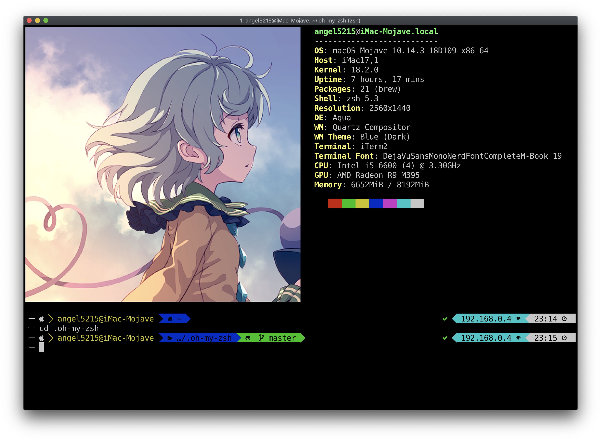

Hasta la fecha no he encontrado un tutorial **en español** que nos diga paso a paso qué hacer. Por esta razón decidí escribir este pequeño tutorial con imágenes para que cualquiera con algo de tiempo pueda personalizar su terminal de una mejor manera.

En general, el procedimiento varía muy poco de un sistema operativo a otro y es relativamente sencillo lograrlo. 


Para evitar omitir detalles, aquí colocaré los pasos a seguir tanto para macOS y Manjaro Linux.

***Nota**: al momento de escribir este texto, macOS se encuentra en su versión 10.14 (Mojave) y Manjaro Linux en su versión 18 (Illyria). Aunque no debería haber ningún problema con otras versiones, es mejor que compruebes que todos los paquetes, fuentes o configuraciones que se hacen aquí sean válidas para el momento en el que lo estás intentando.*

## macOS

1. **Instalar Xcode**. Basta con abrir la aplicación de la AppStore y buscar Xcode y hacer clic al botón de `Obtener`.

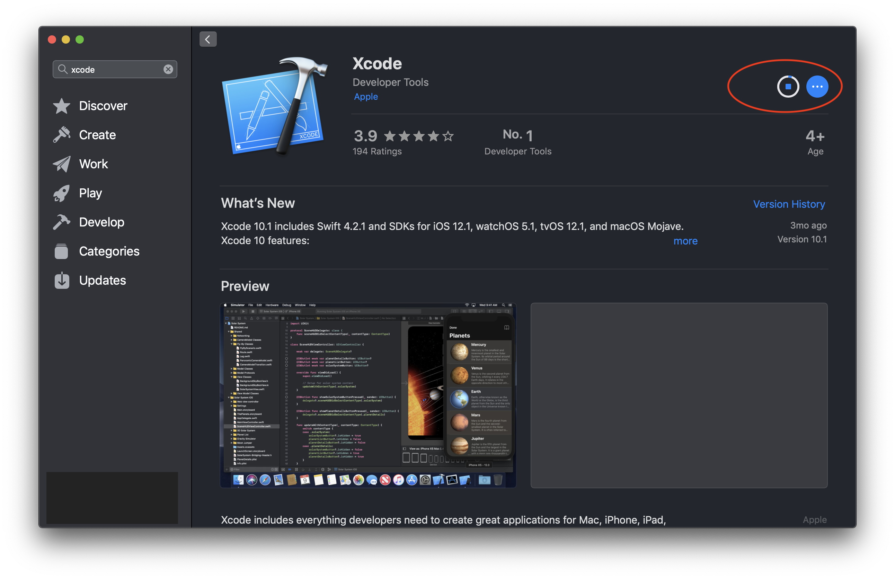

También abrir Xcode y aceptar la licencia de uso.

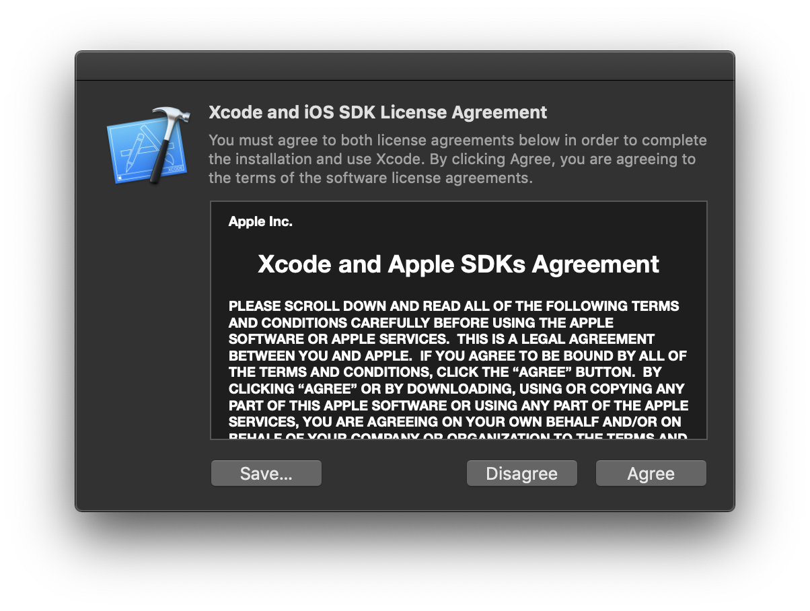

2. Instalación de iTerm2. Este emulador de terminal es capaz de manejar imágenes, iconos y ligaduras de fuentes en la terminal. En mi opinión es mucho más amigable que la aplicación de Terminal por defecto de macOS.

Su página oficial es [iTerm2](https://www.iterm2.com/). La página nos descargará un ZIP, hay que descomprimirlo y arrastrar la aplicación a la carpeta de Aplicaciones de la computadora.

3. Instalación de las herramientas de línea de comandos de Xcode.

Abre una terminal y ejecuta el siguiente comando. 

```bash
xcode-select --install
```

Verás la siguiente ventana luego de escribirlo:

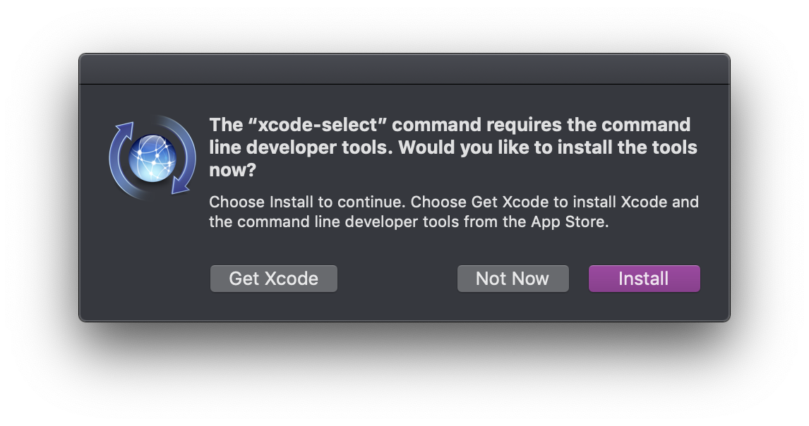


### ¿Por qué instalamos estas herramientas?

Para poder tener imágenes en la terminal de forma fácil es necesario instalar un paquete llamado `neofetch`. Para esto utilizaremos el gestor de paquetes Homebrew. Uno de los requisitos para poder utilizar Homebrew es tener instaladas las herramientas de línea de comandos. 

Este paso podría omitirse, ya que Homebrew instala automáticamente estas herramientas si nuestra computadora no las tiene. Aun así, considero que es mejor y más claro ver la instalación paso a paso.

Si todo salió bien, al final aparecerá la siguiente ventana.

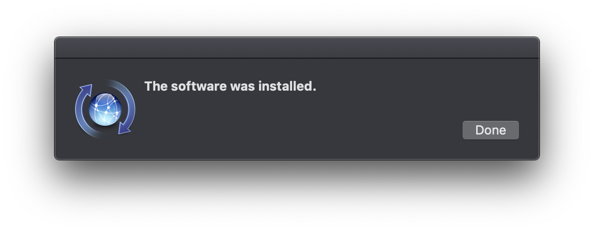

3. **Instalar Homebrew**. Abrir una terminal y ejecutar el siguiente comando. 

**Éste se tomó directamente de la [página oficial de Homebrew](https://brew.sh/index_es), pero es mejor que te asegures que sea el mismo.**

```bash
/usr/bin/ruby -e "$(curl -fsSL https://raw.githubusercontent.com/Homebrew/install/master/install)"
```

**Este comando es el primero de dos en el tutorial que nos pedirá nuestra contraseña. Esto lo hace para configurar algunos permisos que nos permitirán instalar paquetes de manera que no tengamos que estar escribiendo nuestra contraseña a cada rato.**

Al ejecutarlo verás el siguiente texto en la terminal:

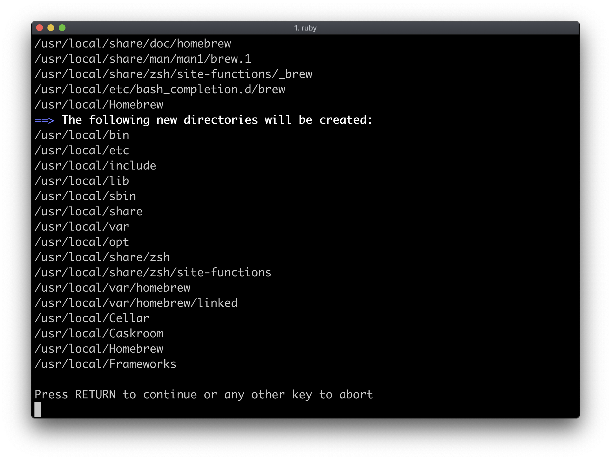

Al hacer clic en **ENTER** pedirá la contraseña. 

Si todos los pasos salen bien, finalmente verás el siguiente aviso.


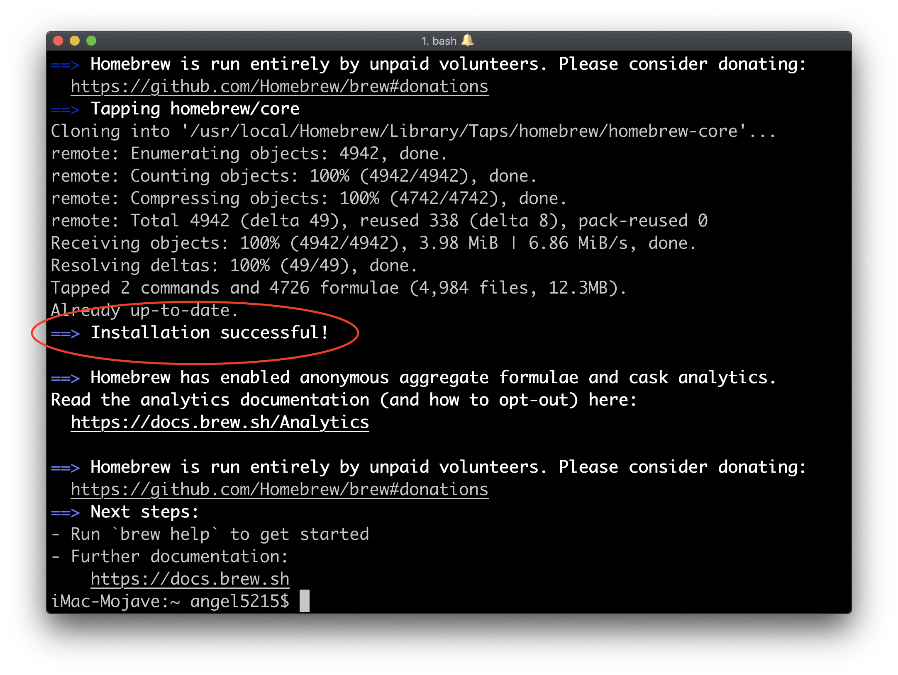

4. Instalación de paquetes usando Homebrew.

Realizaremos la instalación de los siguientes paquetes:

* `bash`: Una versión distinta a la que viene por defecto en macOS. Esta es necesaria para mostrar imágenes en la terminal. La versión que viene por defecto no soporta ciertas secuencias de escape y al momento de intentar mostrar imágenes sólo veremos un montón de texto sin sentido. 
* `neofetch`: Este comando nos sirve para mostrar la información de nuestra computadora. Algunas de sus dependencias se encargan de mostrar las imágenes en la terminal. Por defecto muestra un logo con caracteres ASCII del sistema operativo de tu computadora.

Para instalarlos, ejecutar el siguiente comando:

```bash
brew install bash neofetch
```

Si todo se instala bien, trata de ejecutar el comando `neofetch` en tu terminal. Verás la información de tu computadora.

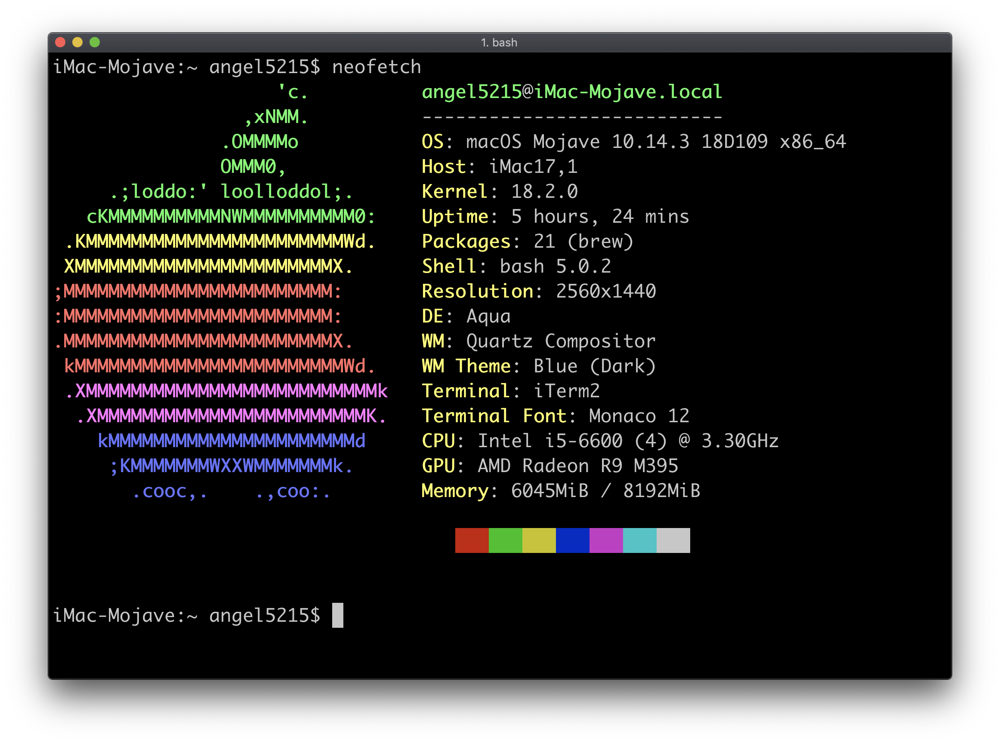


### Extras

Estos paquetes son totalmente opcionales, pero pueden ayudarte a personalizar mejor la terminal.
* `fortune`: Muestra una cita diferente cada que se ejecuta.
* `cowsay`: Muestra una vaca diciendo algún texto que se le pase al comando. Puede editarse para que muestre otro tipo de arte, como un dinosaurio por ejemplo.

Si deseas instalarlos:

```bash
brew install fortune cowsay
```

Un ejemplo de lo anterior está en la siguiente imagen.

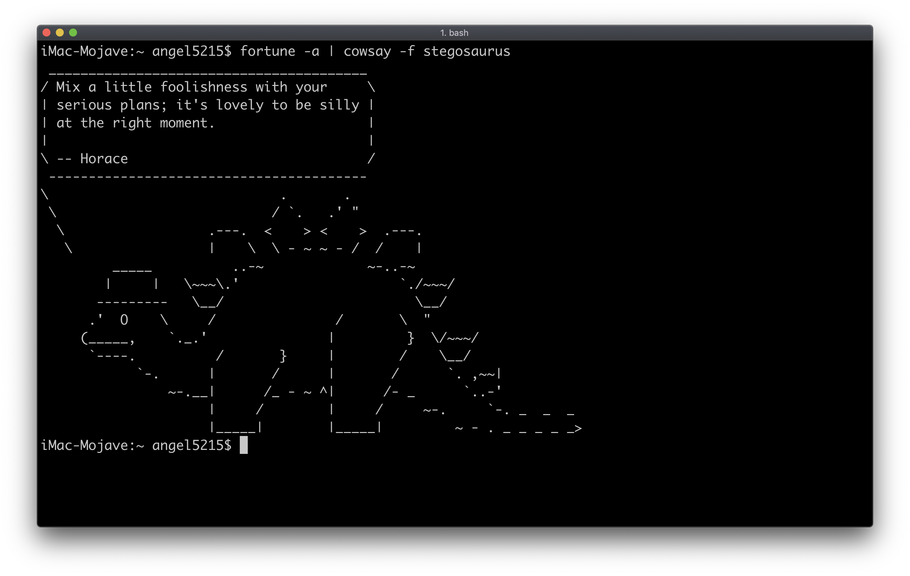

5. Instalación de Oh-My-ZSH

Por defecto, la shell de nuestra computadora es `bash`, pero creo que el autocompletado de `zsh` y su personalización es mucho más sencilla. 

Además, gracias al framework Oh-My-ZSH, la configuración se vuelve mucho más sencilla. 

**Una vez, más, este comando se tomó desde [el repositorio oficial en GitHub](). Pero es mucho mejor que verifiques que siga siendo válido.**

**Este comando es el segundo que pedirá la contraseña. Esto lo hace porque cambiar de shell requiere de permisos de administrador.**

```bash
sh -c "$(curl -fsSL https://raw.githubusercontent.com/robbyrussell/oh-my-zsh/master/tools/install.sh)"
```

Si todo sale bien, verás la siguiente pantalla en la terminal:

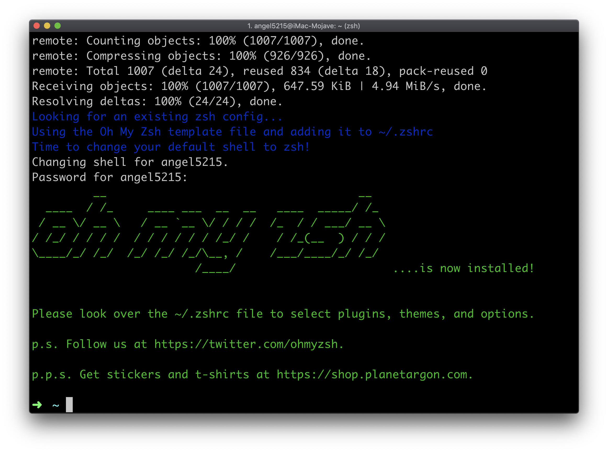

6. Instalación del tema **POWERLEVEL9K**. 

La imagen al principio de este archivo muestra la terminal con barras de diferentes colores, íconos, la IP de nuestra computadora y la hora. Todo esto es muy sencillo hacerlo con un tema de Oh-My-ZSH llamado POWERLEVEL9K.

Para su instalación, en la terminal ejecutar el siguiente comando.

**Este comando se tomó del repositorio oficial en GitHub, pero no de la página principal, sino del [tutorial de instalación](https://github.com/bhilburn/powerlevel9k/wiki/Install-Instructions#option-2-install-for-oh-my-zsh). Verifica que aún siga siendo válido.**

Este comando únicamente clona el repositorio del tema dentro de una carpeta oculta en el directorio HOME de nuestro usuario: `~/.oh-my-zsh/custom/themes/powerlevel9k`

```zsh
git clone https://github.com/bhilburn/powerlevel9k.git ~/.oh-my-zsh/custom/themes/powerlevel9k
```

Si todo sale bien, verás lo siguiente en tu terminal:

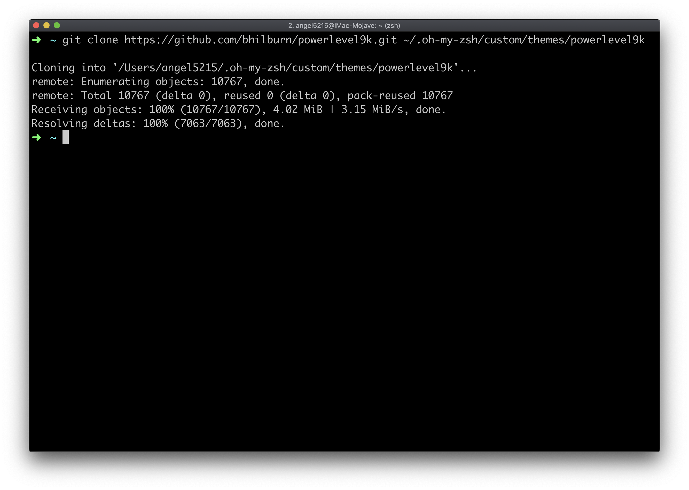

7. Configuración de POWERLEVEL9K.

Para mostrar este tema es necesario editar el archivo de configuración de ZSH: `~/.zshrc`. 

Es posible editar este archivo con cualquier editor de texto como `nano`, `vim`. Por facilidad para tomar las capturas, yo lo editaré con Visual Studio Code. Elige alguna de las opciones que te sea mejor.

#### Opción 1: nano
```zsh
nano ~/.zshrc
```

#### Opción 2: vim
```zsh
vim ~/.zshrc
```

#### Opción 3: Visual Studio Code.
```zsh
code ~/.zshrc
```

### Uso del tema

En el archivo `~/.zshrc` cambiar la línea `ZSH_THEME` a lo siguiente: 

```
ZSH_THEME="powerlevel9k/powerlevel9k"
```

Al guardar el archivo y abrir una nueva terminal, el tema se verá de la siguiente manera:

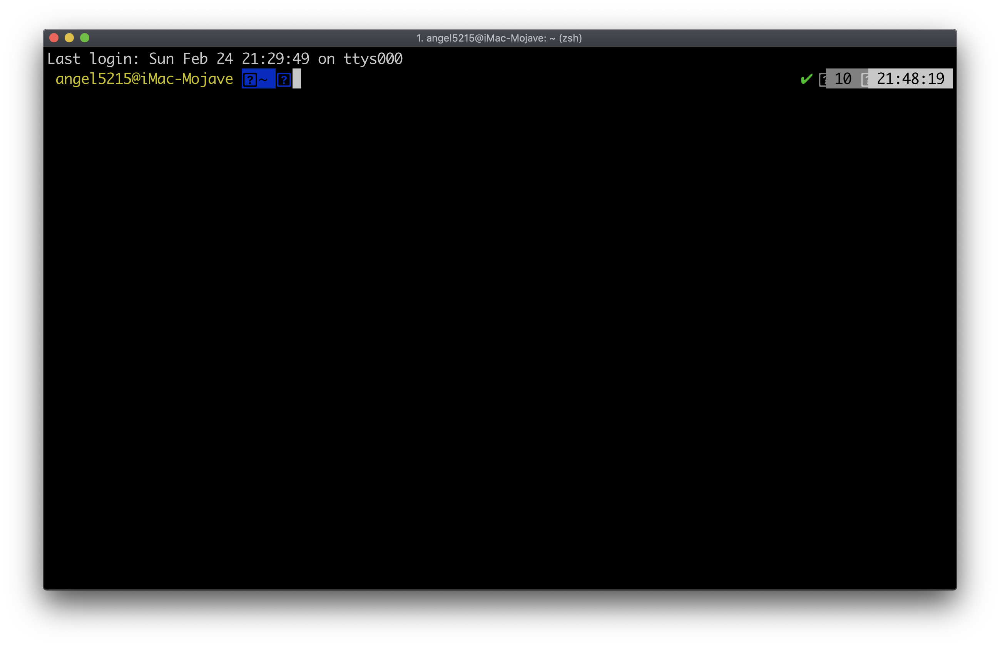

Como podemos ver, la fuente utilizada no es capaz de mostrarnos íconos y las barras de colores se ven a medias. Para arreglar esto instalaremos algunas fuentes llamadas **Nerd Fonts** con Homebrew. 

8. Instalación de fuentes con Homebrew.

Existen muchas formas de instalar las Nerd Fonts, pero en macOS la forma más fácil es con Homebrew.

Algunas de mis favoritas son:

* DejaVu Sans Mono
* Source Code Pro
* Fira Code
* Inconsolata

Este comando le da acceso a instalar fuentes a Homebrew. Abrir una terminal y ejecutarlo.

**Este comando se tomó del [repositorio oficial en GitHub](https://github.com/ryanoasis/nerd-fonts#option-4-homebrew-fonts). Revisa que aún siga siendo válido**.

```zsh
brew tap caskroom/fonts
```

Para buscar el nombre exacto del paquete para instalar una fuente, podemo usar `brew search`:

```zsh
brew search NOMBRE_FUENTE
```

En la siguiente imagen, se usó el comando para buscar información sobre la fuente DejaVu Sans Mono.

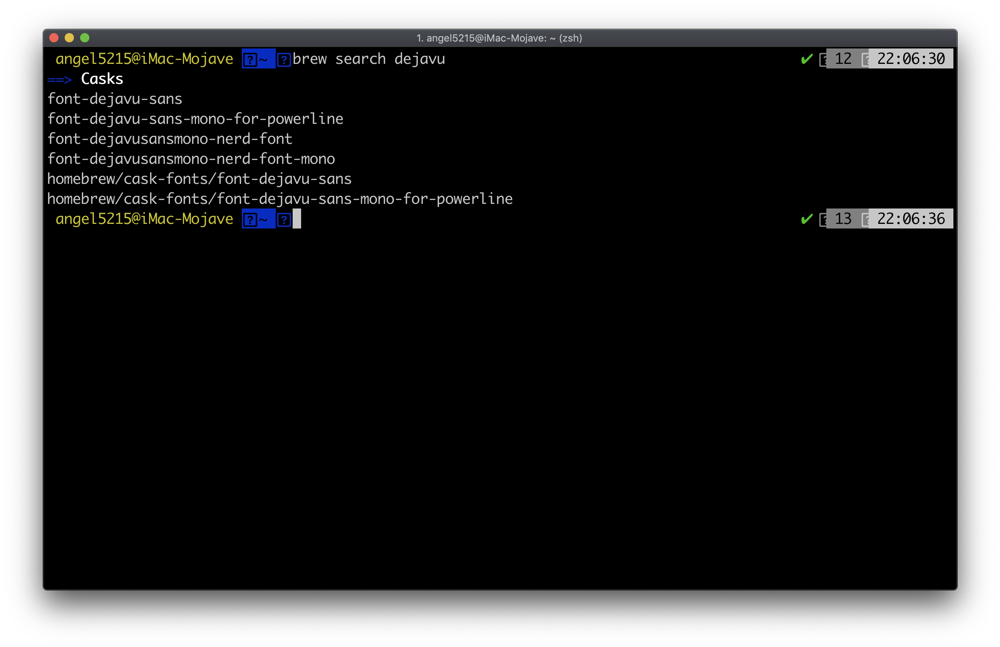


El nombre del paquete es `font-dejavusansmono-nerd-font-mono`. Instalaremos la fuente con el comando `brew cask install`:

```zsh
brew cask install font-dejavusansmono-nerd-font-mono
```

La instalación exitosa se muestra en la siguiente imagen:

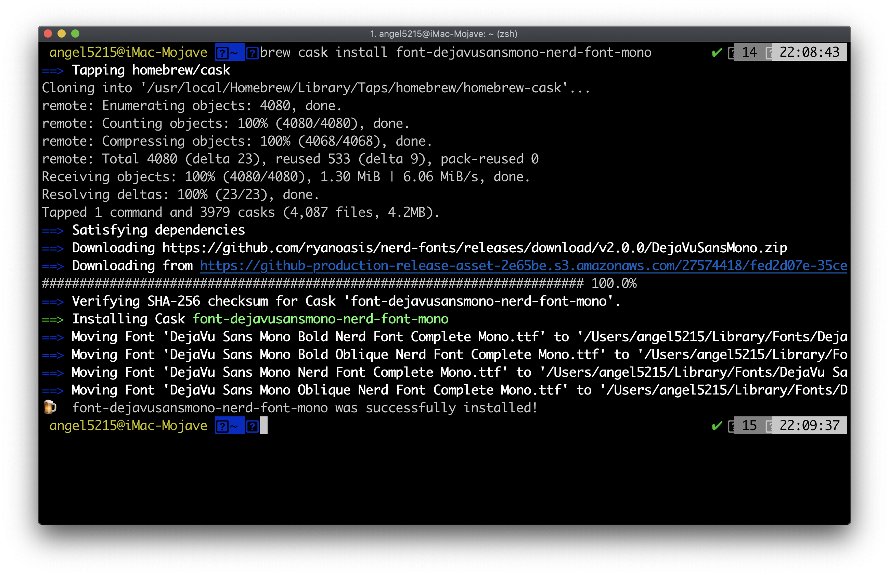

9. Uso de Nerd Fonts en la terminal.

Necesitaremos realizar dos pasos:

a) Colocar en el archivo `~/.zshrc` que utilizaremos Nerd Fonts.
b) Seleccionar una Nerd Font como fuente en iTerm2.

Para la primera, abrir el archivo `~/.zshrc` y colocar la siguiente línea **ANTES** de la configuración del tema (antes de configurar la variable `ZSH_THEME`):

```zsh
POWERLEVEL9K_MODE='nerdfont-complete'
```

El archivo de configuración se verá de esta forma:

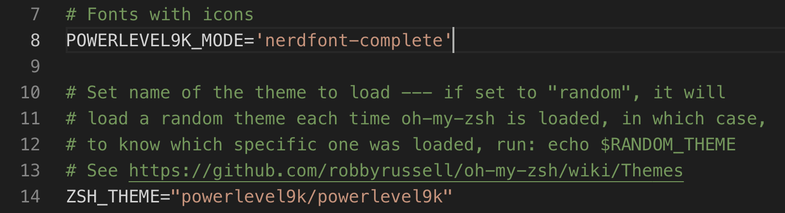

Para la segunda, abrir iTerm. En la barra de herramientas: `iTerm2` -> `Preferences`. En la ventana seleccionar la pestaña `Profiles`. Luego seleccionar la pestaña `Text`. En el boton `Change Font`, seleccionar la Nerd Font que se instaló anteriormente. 

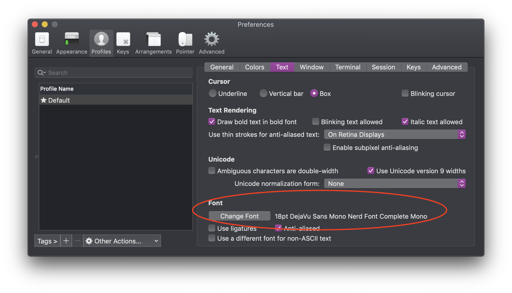

Abrir una nueva terminal. La configuración está casi terminada.

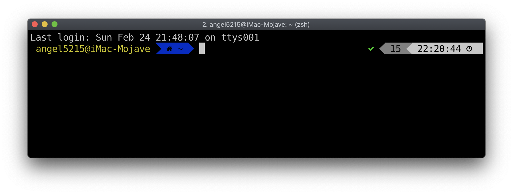

10. **Configuraciones adicionales**.

En la imagen al principio de este archivo se muestra un icono de Apple, así como iconos, una imagen personalizada y neofetch al abrir la terimnal. Esta configuración se puede lograr de manera muy sencilla.

Abrir el archivo `~/.zshrc` y agregar las siguientes líneas al final del archivo. El orden al agregarlas en realidad no importa:

* Configuración del prompt:
    * Elementos a la izquierda.
    * Elementos a la derecha.
    * Formato de la hora.
    * Reducir la ruta absoluta a una sola palabra.
    * Colocar el prompt en una nueva línea.

```zsh
POWERLEVEL9K_LEFT_PROMPT_ELEMENTS=(os_icon context dir rbenv anaconda vcs)
POWERLEVEL9K_RIGHT_PROMPT_ELEMENTS=(status root_indicator background_jobs ip time)
POWERLEVEL9K_TIME_FORMAT='%D{%H:%M}'
POWERLEVEL9K_SHORTEN_DIR_LENGTH=1
POWERLEVEL9K_PROMPT_ON_NEWLINE=true
```

* Configuración para colores cuando se esté en un repositorio de Git.

```zsh
# VCS color customization
POWERLEVEL9K_VCS_CLEAN_FOREGROUND='black'
POWERLEVEL9K_VCS_CLEAN_BACKGROUND='green'
POWERLEVEL9K_VCS_UNTRACKED_FOREGROUND='red'
POWERLEVEL9K_VCS_UNTRACKED_BACKGROUND='yellow'
POWERLEVEL9K_VCS_MODIFIED_FOREGROUND='black'
POWERLEVEL9K_VCS_MODIFIED_BACKGROUND='yellow'
```

* Configuración para mostrar `neofetch` con una imagen.

Esta configuración funciona sin problemas para iTerm2. Pero hay programas que también ofrecen emuladores de terminal como Android Studio o Visual Studio Code. Para evitar problemas al mostrar `neofetch`, lo limitaremos a usar imágenes sólo cuando la terminal sea iTerm2 y mostraremos un ASCII personalizado con cualquier otro emulador.

```zsh
# Images in the terminal
if [[ $TERM_PROGRAM == "iTerm.app" ]]; then
    neofetch --iterm2 ~/neofetch-custom/koishi.png --crop_mode fit
else
    neofetch --ascii "$(fortune -n 60 -a | cowsay -W 60 -f ~/neofetch-custom/sachiko.cow)"
fi
```

El comando `neofetch` acepta imágenes o ASCII. En este caso, se utilizó el comando `fortune` y `cowsay` junto con un archivo ASCII personalizado tomado de [aquí](https://github.com/piuccio/cowsay/blob/master/cows/sachiko.cow).

Si estás utilizando imágenes y no se ven bien, trata de cambiar la opción `--crop_mode fit` por `--crop_mode fill` o intenta quitarlo del comando. Para más información entra [aquí](https://github.com/dylanaraps/neofetch/wiki/What-is-Waifu-Crop%3F) y [aquí](https://github.com/dylanaraps/neofetch/wiki/Images-in-the-terminal).

El resultado final es la imagen que aparece al principio del archivo. Cualquier otra terminal a la que se le configure una Nerd Font y no sea iTerm se verá así:

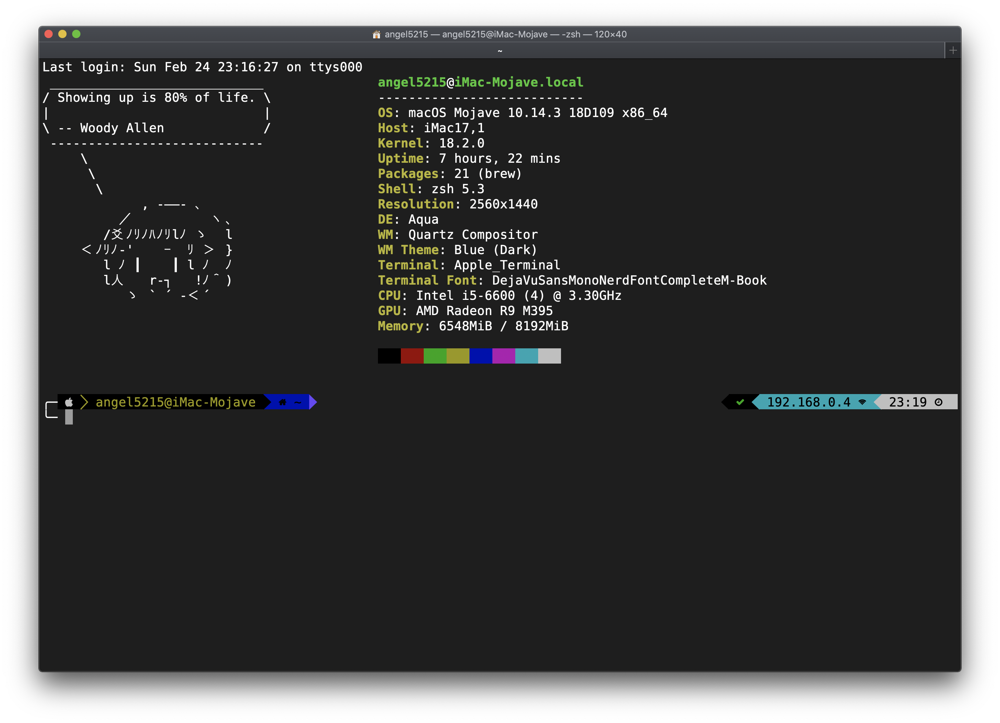

### Configuraciones adicionales.

#### Temas

Si usas iTerm2, es posible instalarle temas. Checa [esta página](https://iterm2colorschemes.com/) para ver qué opciones tienes y sigue el [siguiente repositorio](https://github.com/mbadolato/iTerm2-Color-Schemes) para descargarlos.

Los temas se configuran en `Preferences` -> `Profile`. Luego en la pestaña `Colors` y en la opción `Color presets`.

#### Personalizar el prompt

Si deseas ver qué otras opciones existen para el prompt, entra en la documentación oficial de POWERLEVEL9K en su [repositorio oficial](https://github.com/bhilburn/powerlevel9k#prompt-customization).


## Manjaro

**Queda pendiente redactar un tutorial para Manjaro**.

